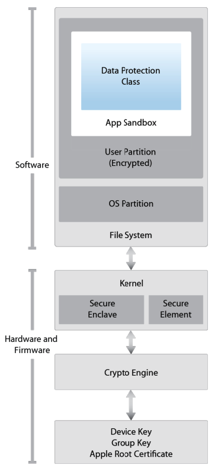
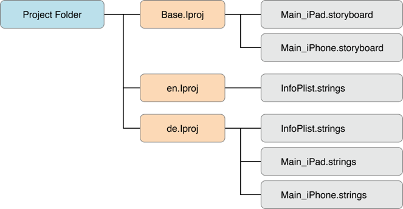
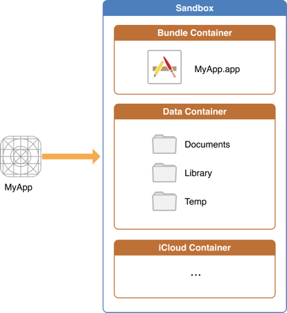

## Обзор платформы iOS

iOS - это мобильная операционная система, которая управляет мобильными устройствами Apple, включая iPhone, iPad и iPod Touch. Она также является основой для Apple tvOS, которая наследует многие функции из iOS.

Подобно операционной системе Apple MacOS (ранее OS X), iOS основана на Darwin, операционной системе Unix с открытым исходным кодом, разработанной Apple. Ядром Darwin является XNU («X is Not Unix»), гибридное ядро, которое объединяет компоненты ядер Mach и FreeBSD.

Однако приложения iOS работают в более ограниченной среде, чем их настольные аналоги. Приложения iOS изолированы друг от друга на уровне файловой системы и значительно ограничены с точки зрения доступа к системному API.

Чтобы защитить пользователей от вредоносных приложений, Apple ограничивает и контролирует доступ к приложениям, которые разрешено запускать на устройствах iOS. Магазин Apple App Store - единственная официальная платформа распространения приложений. Там разработчики могут предлагать свои приложения, а потребители могут покупать, загружать и устанавливать приложения. Этот стиль дистрибуции отличается от Android, который поддерживает несколько магазинов приложений, а также стороннюю загрузку(sideloading) - установка приложения на устройство iOS, в обход официального магазина приложений.

Раньше сторонние загрузки были возможны только с джейлбрейком или c помощью сложных, обходных техник. С iOS 9 или выше можно выполнить [sideload via Xcode](https://www.igeeksblog.com/how-to-sideload-apps-on-iphone-ipad-in-ios-10/ "How to Sideload Apps on iPhone and iPad Running iOS 10 using Xcode 8").

Приложения iOS изолированы друг от друга с помощью песочницы(sandbox) Apple (исторически названную Seatbelt), механизм обязательного контроля доступа (MAC), описывающий ресурсы, к которым приложение может и не может получить доступ. По сравнению с обширными возможностями Android Binder IPC, iOS предлагает очень мало вариантов IPC, сводя к минимуму потенциальную поверхность атаки.

Однородное аппаратное обеспечение и жесткая интеграция оборудования и программного обеспечения создают еще одно преимущество для безопасности. Каждое устройство iOS предлагает функции безопасности: безопасная загрузка, keychain, обеспеченный оборудованием, и шифрование файловой системы. Обновления iOS обычно быстро выкатываются на большой процент пользователей, что уменьшает необходимость поддержки старых, незащищенных версий iOS.

Несмотря на многочисленные преимущества iOS, разработчикам приложений iOS все равно нужно беспокоиться о безопасности. Защита данных, Keychain, TouchID-аутентификация и сетевая безопасность по-прежнему оставляют место для совершения ошибок. В следующих главах мы описываем архитектуру безопасности iOS, объясняем базовую методологию тестирования безопасности и представляем инструкции по обратному проектированию.

### Архитектура безопасности iOS

[Архитектура безопасности iOS](https://www.apple.com/business/docs/iOS_Security_Guide.pdf "Apple iOS Security Guide") состоит из шести основных частей:

- Аппаратная безопасность
- Безопасная загрузка
- Цифровая подпись
- Песочница
- Шифрование и защита данных
- Обход основных эксплойтов



#### Аппаратная безопасность

Архитектура безопасности iOS хорошо использует аппаратные функции безопасности, которые повышают общую производительность. Каждое устройство iOS поставляется с двумя встроенными 256-битными ключами AES - GID и UID, которые объединены и скомпилированы в процессор приложений и Secure Enclave во время производства. Нет прямого способа прочитать эти ключи с помощью программного обеспечения или отладочных интерфейсов, таких как JTAG. Операции шифрования и дешифрования выполняются с помощью аппаратных крипто-движков AES, которые имеют эксклюзивный доступ к этим ключам.

GID - это значение, разделяемое всеми процессорами в классе устройств, используемое для предотвращения несанкционированного доступа к файлам прошивки и другим криптографическим задачам, не связанным напрямую с личными данными пользователя. UID, который уникален для каждого устройства, используется для защиты иерархии ключей, которая используется для шифрования файловой системы на уровне устройства. Поскольку UID не записывается во время производства, даже Apple не может восстановить ключи шифрования файлов для определенного устройства.

Чтобы обеспечить безопасное удаление конфиденциальных данных из флэш-памяти, устройства iOS включают функцию под названием [Effaceable Storage] (https://www.apple.com/business/docs/iOS_Security_Guide.pdf "Руководство по безопасности iOS"). Эта функция обеспечивает прямой низкоуровневый доступ к технологии хранения, что позволяет надежно стереть выбранные блоки.

#### Безопасная загрузка

Когда устройство iOS включено, оно считывает исходные инструкции из Boot ROM, доступного только для чтения, который загружает систему. Загрузочный диск содержит неизменяемый код и сертификат Apple Root CA, который вытравлен на кристалле кремния, во время процесса изготовления(процессора), тем самым создавая корень цепочки доверия(root of trust). Затем загрузочный диск должен убедиться, что подпись загрузчика iBoot верна. После проверки подписи iBoot проверяет подпись следующего этапа загрузки - ядра iOS. Если какой-либо из этих шагов завершится неудачей, процесс загрузки завершится немедленно, и устройство войдет в режим восстановления и отобразит экран «Подключитесь к iTunes». Однако, если Boot ROM не загружается, устройство переходит в специальный режим восстановления низкого уровня, называемый DFU(Device Firmware Upgrade). Это последнее средство для восстановления устройства до его первоначального состояния. В этом режиме устройство не будет показывать никаких признаков активности, то есть его экран ничего не отображает.

Весь этот процесс называется "Secure Boot Chain". Его цель - обеспечить, чтобы система и ее компоненты были написаны и распространены Apple. Secure Boot Chain состоит из ядра, загрузчика, расширения ядра и прошивки базовой полосы.

#### Подпись кода

Apple внедрила сложную систему DRM, чтобы убедиться, что на их устройствах работает только одобренный Apple код. Другими словами, вы не сможете запускать какой-либо код на устройстве iOS, которое не было взломанным(jailbreaked), если Apple явно не разрешит его использование. Конечные пользователи должны устанавливать приложения только через официальный магазин приложений Apple. По этой причине (и другим) iOS [сравнивают с кристальной тюрьмой](https://www.eff.org/deeplinks/2012/05/apples-crystal-prison-and-future-open-platforms "Apple's Crystal Prison and the Future of Open Platforms").

Для развертывания и запуска приложения требуется профиль разработчика и подписанный Apple сертификат.
Разработчики должны зарегистрироваться в Apple, присоединиться к [Программе разработчиков Apple](https://developer.apple.com/support/compare-memberships/ «Членство в Программе разработчиков Apple») и оплачивать ежегодную подписку, чтобы получить полный спектр услуг по разработке и развертыванию приложений. Также есть бесплатная учетная запись, которая позволяет вам скомпилировать и развернуть приложение(но не распространять их в App Store) с помощью сторонней загрузки(sideloading).

#### Шифрование и защита данных

*Шифрование кода FairPlay* применяется к приложениям, загруженным из App Store. FairPlay был разработан как DRM для мультимедийного контента, приобретенного через iTunes. Первоначально шифрование Fairplay применялось к потокам MPEG и QuickTime, но одни и те же базовые понятия также могут применяться к исполняемым файлам. Основная идея заключается в следующем: после регистрации новой учетной записи пользователя Apple будет создана и назначена пара с открытым/закрытым ключом. Закрытый ключ надежно хранится на вашем устройстве. Это означает, что шифрованный код FairPlay может быть расшифрован только на устройствах, связанных с вашей учетной записью. Обратное шифрование FairPlay обычно получается путем запуска приложения на устройстве, а затем копировании дешифрованного кода из памяти (см. также «Базовое тестирование безопасности на iOS»).

Apple встроила шифрование в аппаратное обеспечение и прошивку своих устройств iOS с момента выпуска iPhone 3GS. Каждое устройство имеет специальный аппаратный крипто-движок, основанный на 256-битной AES, которая работает с хэш-функцией SHA-1. Кроме того, есть уникальный идентификатор (UID), встроенный в оборудование каждого устройства, с 256-битным ключом AES, подключенным к прикладному процессору. Этот UID уникален и не записан в другом месте. На момент написания ни программное обеспечение, ни прошивка не могли напрямую считывать UID. Поскольку ключ вытравливается на кремниевом чипе, его нельзя подделать или обойтись без него. Доступ к нему может получить только крипто-движок.

Встраивание шифрования в физическую архитектуру, представляет возможным шифрование всех данных на устройстве iOS, что делает, в свою очередь, это стандартным свойством безопасности системы. В результате защита данных реализуется на уровне программного обеспечения и работает с шифрованием аппаратного обеспечения и прошивки для обеспечения большей безопасности.

Когда защита данных включена, каждый файл данных связан с определенным классом. Каждый класс поддерживает различный уровень доступности и защищает данные на основе времени, когда данные должны быть доступны. Операции шифрования и дешифрования, связанные с каждым классом, основаны на нескольких ключевых механизмах, которые используют UID устройства и код доступа, ключ класса, ключ файловой системы и ключ для каждого файла. Ключ для файла используется для шифрования содержимого файла. Ключ класса обернут вокруг ключа для каждого файла и сохраняется в метаданных файла. Ключ файловой системы используется для шифрования метаданных. UID и код доступа защищают ключ класса. Эта операция невидима для пользователей. Чтобы включить защиту данных, код доступа(пароль) должен использоваться при доступе к устройству. Код доступа разблокирует устройство. В сочетании с UID код доступа также создает ключи шифрования iOS, которые более устойчивы к взломам и атакам brute force(перебора). Включение защиты данных является основной причиной для пользователей, чтобы пользоваться паролями на своих устройствах.

#### Песочница

[App sandbox] (https://developer.apple.com/library/content/documentation/FileManagement/Conceptual/FileSystemProgrammingGuide/FileSystemOverview/FileSystemOverview.html "Основы файловой системы") - это технология управления доступом iOS. Она применяется на уровне ядра. Её целью является ограничение системных и пользовательских повреждений данных, которые могут возникнуть, когда приложение скомпрометировано.

Песочница была основной функцией безопасности с момента первого выпуска iOS. Все сторонние приложения работают под одним и тем же пользователем (`mobile`), и только несколько системных приложений и сервисов выполняются как «root». Обычные приложения iOS ограничены *контейнером*, который ограничивает доступ к собственным файлам приложения и очень ограниченному числу системных API. Доступ ко всем ресурсам (таким как файлы, сетевые сокеты, IPC и разделяемая память) управляется песочницей. Эти ограничения работают следующим образом: [#Jonathan Levin]:

- Процесс приложения ограничен его собственным каталогом (в разделе /​​var/mobile/Containers/Bundle/Application/) с помощью процесса, похожего на chroot.
- Системные вызовы `mmap` и` mmprotect` изменяются, чтобы приложения не могли делать исполняемыми страницы памяти, доступные для записи, и останавливать процесс выполнения динамически сгенерированного кода. В сочетании с подписью кода и FairPlay это строго ограничивает то, какой код может работать при определенных обстоятельствах (например, весь код приложений, распространяемых через магазин приложений, одобрен Apple).
- Процессы изолированы друг от друга, даже если они принадлежат одному и тому же UID.
- Доступ к аппаратным драйверам напрямую невозможен. Вместо этого они должны использоваться через библиотеки Apple.

#### Обход основных эксплойтов(General Exploit Mitigations)

iOS реализует ASLR(рандомизацию компоновки адресного пространства) и бит XN(eXecute Never) для уменьшения вероятности появления атак выполнения кода.

ASLR рандомизирует местоположение памяти исполняемого файла программы, данных, кучи и стека каждый раз, когда программа выполняется. Поскольку общие библиотеки должны быть статическими для использования несколькими процессами, адреса общих библиотек рандомизируются каждый раз, когда ОС загружается, а не каждый раз, когда вызывается программа. Это затрудняет предсказание конкретных адресов функций и библиотек, тем самым предотвращая такие атаки, как return-to-libc, которая включает в себя адреса памяти основных функций libc.

Механизм XN позволяет iOS отмечать выбранные сегменты памяти процесса как неисполняемые. В iOS стек и куча процесса пользовательского режима отмечены как неисполнимые. Страницы, доступные для записи, не могут отмечаться как исполняемые файлы одновременно. Это позволяет злоумышленникам выполнить машинный код, вставленный в стек или кучу. 

### Разработка ПО на платформе iOS

Как и другие платформы, Apple предоставляет SDK, который помогает разработчикам разрабатывать, устанавливать, запускать и тестировать собственные приложения для iOS. Xcode - IDE для разработки от Apple. Приложения iOS разрабатываются на Objective-C или Swift.

Objective-C - это объектно-ориентированный язык программирования, который добавляет обмен сообщениями в стиле Smalltalk к языку программирования C. Он используется на macOS для разработки настольных приложений и iOS для разработки мобильных приложений. Swift является приемником Objective-C и позволяет взаимодействовать с Objective-C.

Swift был представлен в Xcode 6 в 2014 году.

На устройстве, не предназначенном для взлома, есть два способа установки приложения, минуя App Store:

1. Через Enterprise Mobile Device Management. Для этого требуется сертификат компании, подписанный Apple.
2. Через стороннюю загрузку, то есть путем подписания приложения сертификатом разработчика и его установки на устройство через Xcode. Ограниченное количество устройств может быть использовано с одним и тем же сертификатом.

### Приложения в iOS

Приложения iOS распространяются в архивах IPA (iOS App Store). Файл IPA представляет собой ZIP-архив, содержащий весь код и ресурсы, необходимые для выполнения приложения.

Файлы IPA имеют встроенную структуру каталогов. Пример ниже показывает эту структуру на высоком уровне:

- `/Payload/` папка содержит все данные приложения. Мы вернемся к содержимому этой папки более подробно.
- `/Payload/Application.app` содержит сами данные приложения (ARM-скомпилированный код) и связанные с ним статические ресурсы.
- `/iTunesArtwork` - это изображение PNG размером 512x512 пикселей(1400х1400 минимум и максимум 2048х2048 на момент перевода), используемое в качестве значка приложения.
- `/iTunesMetadata.plist` содержит различные биты информации, включая имя и идентификатор разработчика, идентификатор пакета, информацию об авторских правах, жанр, название приложения, дату выпуска, дату покупки и т.д.
- `/WatchKitSupport/WK` является примером расширения. Этот конкретный пакет содержит делегат расширения и контроллеры для управления интерфейсами и реагирования на пользовательские взаимодействия на часах Apple.

#### Содержимое IPA - детальное рассмотрение

Давайте подробнее рассмотрим различные файлы в контейнере IPA. Apple использует относительно плоскую структуру с несколькими посторонними каталогами для экономии дискового пространства и упрощения доступа к файлам. Каталог пакетов верхнего уровня содержит исполняемый файл приложения и все ресурсы, которые использует приложение (например, значок приложения, другие изображения и локализованный контент).

- **MyApp**: исполняемый файл, содержащий скомпилированный (нечитаемый) исходный код приложения.
- **Application**: значки приложений.
- **Info.plist**: информация о конфигурации, такая как идентификатор пакета, номер версии и отображаемое имя приложения.
- **Launch images**: изображения, показывающие начальный интерфейс приложения в определенной ориентации. Система использует одно из предоставленных изображений запуска в качестве временного фона, пока приложение не будет полностью загружено.
- **MainWindow.nib**: объекты интерфейса по умолчанию, которые загружаются при запуске приложения. Другие объекты интерфейса затем загружаются из других файлов nib или программно создаются приложением(используется все реже, чаще - файл .storyboard, по умолчанию уже несколько лет XCode не создает этот файл, а создает Main.storyboard - комментарий переводчика).
- **Settings.bundle**: настройки приложения для отображения в приложении «Настройки».
- **Custom resource files**: нелокализованные ресурсы помещаются в каталог верхнего уровня, а локализованные ресурсы помещаются в подкаталоги конкретных языковых наборов приложений. Ресурсы включают файлы nib, изображения, звуковые файлы, файлы конфигурации, файлы строк и любые другие пользовательские файлы данных, которые использует приложение.

Папка language.lproj существует для каждого языка, поддерживаемого приложением. Он содержит файл Storyboard и файлы локализации строк.

- Storyboard представляет собой визуальное представление пользовательского интерфейса приложения iOS. Он показывает экраны и соединения между этими экранами.
- Формат файла строк состоит из одной или нескольких пар ключ-значение и дополнительных комментариев.



На взломанном устройстве вы можете восстановить IPA для установленного приложения iOS с помощью [установщика IPA](https://github.com/autopear/ipainstaller "установщик IPA"). Во время оценок мобильной безопасности разработчики часто дают вам IPA напрямую. Они могут отправить вам фактический файл или предоставить доступ к используемой платформе распространения, например, [HockeyApp] (https://hockeyapp.net/ "HockeyApp") или [Testflight] (https://developer.apple.com/testflight/ "Testflight").

#### Структура приложения в системе файлов iOS

Начиная с iOS 8, изменились способы хранения приложений на устройстве. Раньше приложения распаковывались в папку `/var/mobile/applications/`. Приложения идентифицировались с помощью UUID (Universal Unique Identifier), 128-битного номера. Этот номер был именем папки, в которой было сохранено приложение. Папки статических пакетов и данных приложения теперь хранятся где-то в другом месте. Эти папки содержат информацию, которая должна быть тщательно проверена во время оценки безопасности приложения.

- `/var/mobile/Containers/Bundle/Application/[UUID]/Application.app` содержит ранее упомянутые данные application.app и хранит статический контент, а также бинарный файл, скомпилированный ARM. Содержимое этой папки используется для проверки подписи кода.
- `/var/mobile/Containers/Data/Application/[UUID]/Documents` содержит все пользовательские данные. Конечный пользователь приложения инициирует создание этих данных.
- `/var/mobile/Containers/Data/Application/[UUID]/Library` содержит все файлы, не относящиеся к конкретным пользователям, такие как файлы кэшей, предпочтений, файлы cookies и список свойств (plist).
- `/var/mobile/Containers/Data/Application/[UUID]/tmp` содержит временные файлы, которые не нужны между запусками приложений.

На следующем рисунке представлена ​​структура папок приложения:



#### Процесс установки

Существуют разные способы установки IPA на устройство iOS. Самый простой способ - это iTunes, который является медиаплеером Apple по умолчанию. iTunes доступен для MacOS и Windows. iTunes позволяет пользователям загружать приложения из App Store и устанавливать их на устройство iOS. Вы также можете использовать [iTunes для установки файла IPA на устройство](https://www.youtube.com/watch?v=nNn85Qvznug "Как установить приложение через iTunes").

В Linux вы можете использовать [libimobiledevice] (https://www.libimobiledevice.org/ "libimobiledevice"), кроссплатформенную библиотеку протокола ПО и набор инструментов для нативной связи с устройствами iOS. Вы можете устанавливать пакеты через USB-соединение через ideviceinstaller. Соединение реализовано с помощью демона мультиплексирования USB [usbmuxd](https://www.theiphonewiki.com/wiki/Usbmux "Usbmux"), который обеспечивает туннель TCP через USB.

На устройстве iOS фактический процесс установки обрабатывается демоном installd, который распаковывает и устанавливает приложение. Чтобы интегрировать сервисы приложений или быть установленными на устройстве iOS, все приложения должны быть подписаны сертификатом, выпущенным Apple. Это означает, что приложение может быть установлено только после успешной проверки подписи кода. Тем не менее, на телефоне с джейлбрейком вы можете обойти эту функцию безопасности с помощью [AppSync] (http://repo.hackyouriphone.org/appsyncunified), пакета, доступного в магазине Cydia. Cydia - альтернативный магазин приложений. Он содержит множество полезных приложений, которые используют привилегии root для предоставления расширенных функций. AppSync - это надстройка(tweak), которая исправляет installd, позволяя устанавливать поддельные IPA-пакеты.

IPA также может быть непосредственно установлен через командную строку с помощью [ipainstaller] (https://github.com/autopear/ipainstaller "Установщик IPA"). После того, как вы скопируете IPA на устройство, используя, например, scp (защищенное копирование), вы можете выполнить ipainstaller с именем файла IPA:

```shell
$ ipainstaller App_name.ipa
```

#### Права приложения

В отличие от приложений для Android, приложения iOS не имеют предварительно назначенных разрешений. Вместо этого пользователю предлагается предоставить разрешение во время выполнения, когда приложение впервые пытается использовать чувствительный API. Приложения, которым были предоставлены разрешения, перечислены в меню «Настройки»> «Конфиденциальность», что позволяет пользователю изменять настройки приложения. Apple называет эту концепцию разрешений [контроль конфиденциальности] (https://support.apple.com/en-sg/HT203033 "Apple - о конфиденциальности и службах местоположения в iOS 8 и более поздних версиях").

Разработчики iOS не могут напрямую устанавливать запрашиваемые разрешения - они косвенно запрашивают их с помощью чувствительных API. Например, при доступе к контактам пользователя любой вызов в CNContactStore блокирует приложение, после чего пользователю предлагается предоставить или запретить доступ. Начиная с iOS 10.0, приложения должны включать ключи описания использования(usage description keys) для данных, которые им необходимы(например, NSContactsUsageDescription).

Следующие API-интерфейсы [требуют разрешения пользователя] (https://www.apple.com/business/docs/iOS_Security_Guide.pdf "Руководство по безопасности iOS"):

- Contacts
- Microphone
- Calendars
- Camera
- Reminders
- HomeKit
- Photos
- Health
- Motion activity and fitness
- Speech recognition
- Location Services
- Bluetooth sharing
- Media Library
- Social media accounts
