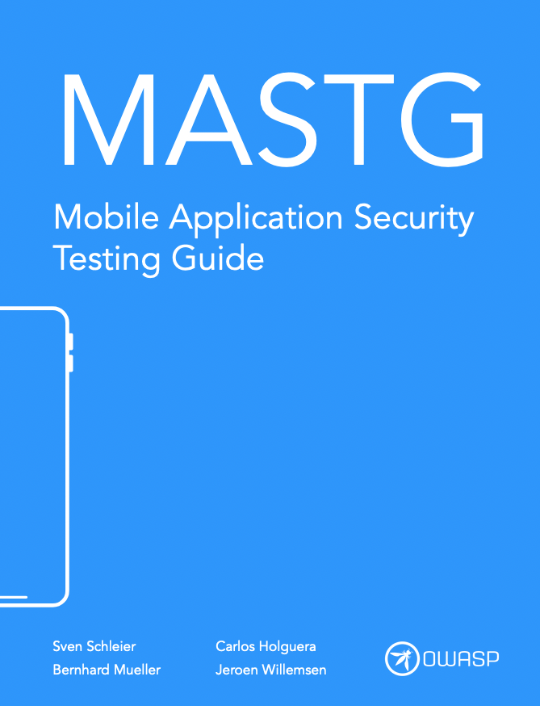
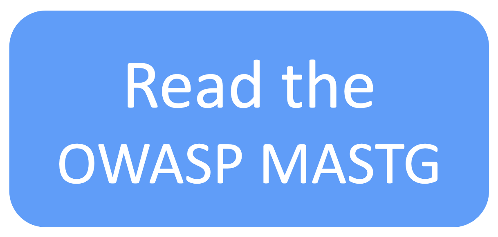
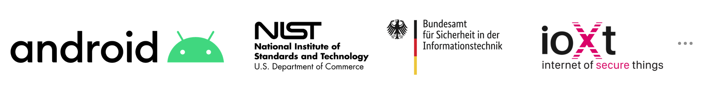
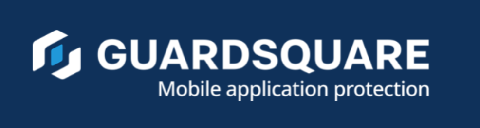

# OWASP Mobile Application Security Testing Guide (MASTG)

[](https://owasp.org/projects/)
[](https://creativecommons.org/licenses/by-sa/4.0/ "CC BY-SA 4.0")

[](https://github.com/OWASP/mastg/actions?query=workflow%3A%22Markdown+Linter%22)
[](https://github.com/OWASP/mastg/actions?query=workflow%3A%22URL+Checker%22)

The **OWASP Mobile Application Security Testing Guide (MASTG)** is a comprehensive manual for mobile app security testing and reverse engineering. It describes technical processes for verifying the [OWASP Mobile Security Weakness Enumeration (MASWE)](https://github.com/OWASP/maswe "MASWE") weaknesses, which are in alignment with the controls listed in the [OWASP Mobile Application Verification Standard (MASVS)](https://github.com/OWASP/masvs "MASVS").

> [OWASP MAS](https://mas.owasp.org): [OWASP MASVS](https://mas.owasp.org/MASVS) ➡ [OWASP MASWE](https://mas.owasp.org/MASWE) ➡ [OWASP MASTG](https://mas.owasp.org/MASTG)

<br>

<center>
<a href="https://mas.owasp.org/MASTG/">

</a>
</center>

<br>

- 🌐 [Access the MASTG Web](https://mas.owasp.org/MASTG/)
- ✅ [Get the latest Mobile App Security Checklists](https://github.com/OWASP/mastg/releases/latest)
- ⚡ [Contribute!](https://mas.owasp.org/contributing)
- 💥 [Play with our Crackmes](https://mas.owasp.org/crackmes)
- 📞 [Contact Us](https://mas.owasp.org/contact)

<br>

## Trusted by

The OWASP MASVS, MASWE and MASTG are trusted by the following platform providers and standardization, governmental and educational institutions. [Learn more](https://mas.owasp.org/MASTG/0x02b-MASVS-MASTG-Adoption/).

<a href="https://mas.owasp.org/MASTG/0x02b-MASVS-MASTG-Adoption/">

</a>

<br>

## 🥇 MAS Advocates

MAS Advocates are industry adopters of the OWASP MASVS, MASWE and MASTG who have invested a significant and consistent amount of resources to push the project forward by providing consistent high-impact contributions and continuously spreading the word. [Learn more](https://mas.owasp.org/MASTG/0x02c-Acknowledgements).

<br>

<a href="https://mas.owasp.org/MASTG/0x02c-Acknowledgements#our-mastg-advocates">


</a>

<br>

## 🐳 Docker Support

You can run the MASTG tools using Docker to avoid installing dependencies locally.

### Building the Image
```bash
docker build -t mastg .
```

### Running with Local MASVS
To use a local copy of MASVS (e.g., for testing changes without downloading), mount it as a volume:

```bash
docker run -v $(pwd):/app -v /path/to/local/OWASP_MASVS.yaml:/app/masvs.yaml -e MASVS_LOCAL_PATH=/app/masvs.yaml mastg
```

Or use Docker Compose:
```bash
docker-compose up
```

### Advanced Volume Mounting
The recommended folder structure for local development is:
- `mastg/` (this repo)
- `MASVS/` (clone of OWASP/masvs)

If you have this structure, you can mount the MASVS directory directly:

```yaml
    volumes:
      - ./MASVS:/app/MASVS
    environment:
      - MASVS_LOCAL_PATH=/app/MASVS
```
