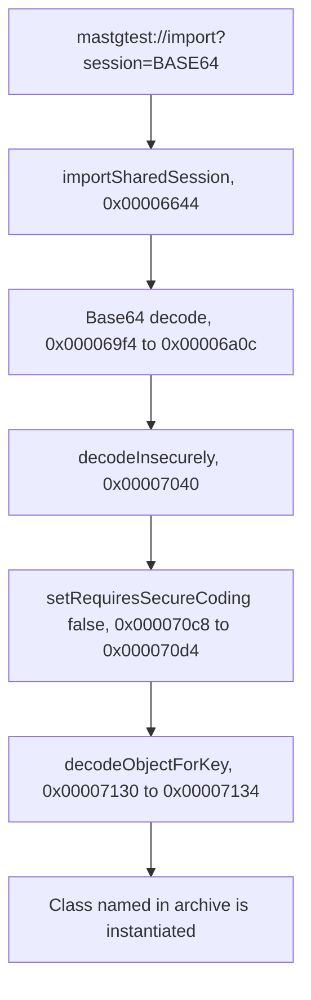
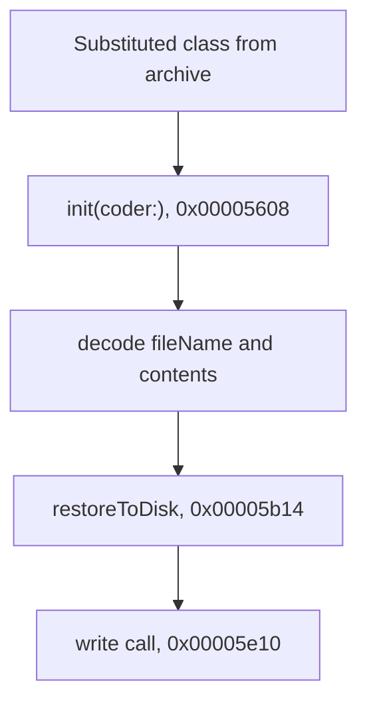

## Sample

The sample imports a user session that arrives in a custom URL scheme (`mastgtest://import?session=<base64 archive>`), which an attacker can deliver from Safari, Notes, or another app. `Info.plist` registers the `mastgtest` scheme and `MASTestAppApp.swift` forwards the opened URL to `mastgTest()`. For example:

```bash
mastgtest://import?session=YnBsaXN0MDDUAQIDBAUGBwpYJHZlcnNpb25ZJGFyY2hpdmVyVCR0b3BYJG9iamVjdHMSAAGGoF8QD05TS2V5ZWRBcmNoaXZlctEICVRyb290gAGlCwwTFBVVJG51bGzTDQ4PEBESWGNvbnRlbnRzViRjbGFzc1hmaWxlTmFtZYADgASAAl8QE3B3bmVkX3ZpYV9saW5rLmh0bWxfEG08IWRvY3R5cGUgaHRtbD48aHRtbD48Ym9keT48aDE%2BUHduZWQgdmlhIGRlZXAgbGluazwvaDE%2BPHNjcmlwdD5hbGVydCgicHduZWQgdmlhIGxpbmsiKTwvc2NyaXB0PjwvYm9keT48L2h0bWw%2B0hYXGBlaJGNsYXNzbmFtZVgkY2xhc3Nlc15DYWNoZWREb2N1bWVudKIaG15DYWNoZWREb2N1bWVudFhOU09iamVjdAAIABEAGgAkACkAMgA3AEkATABRAFMAWQBfAGYAbwB2AH8AgQCDAIUAmwELARABGwEkATMBNgFFAAAAAAAAAgEAAAAAAAAAHAAAAAAAAAAAAAAAAAAAAU4%3D
```

The payload was generated using `PayloadGenerator.swift`. It builds a `CachedDocument` archive with an attacker-chosen file name and contents, then base64- and URL-encodes it into a `mastgtest://import?session=...` link. You can regenerate the payload using the following command, which prints the complete link as shown above.

```bash
swift PayloadGenerator.swift
```

{{ PayloadGenerator.swift }}

To test it with the app running on a device, follow @MASTG-TECH-0x01. Once you trigger the URL scheme and the app opens, click on **Start** so the app processes the link.

The payload is deserialized through both an insecure and a secure path:

- The insecure path defines `InsecureUserSession`, which conforms to `NSCoding` instead of `NSSecureCoding`. The imported archive is decoded with `requiresSecureCoding = false` and `decodeObject(forKey:)`, so a substituted archive is decoded without type enforcement.

- The secure path defines `SecureUserSession`, which conforms to `NSSecureCoding`, returns `true` from `supportsSecureCoding`, decodes nested objects with `decodeObject(of:forKey:)`, and reads the top-level object with `unarchivedObject(ofClass:from:)`, which rejects a substituted archive.

The sample also includes `CachedDocument`, a plausible offline-cache model whose `init(coder:)` writes a cached file to disk. Because the insecure path doesn't restrict the decoded class, an attacker who substitutes `CachedDocument` into the link's payload turns that normal cache restore into an attacker-controlled file write that runs during decoding, while the secure path rejects the class before it is instantiated.

{{ MastgTest.swift # Info.plist # MASTestAppApp.swift }}

## Steps

1. Unzip the app package and locate the main binary file using @MASTG-TECH-0058. In this case, the binary is `./Payload/MASTestApp.app/MASTestApp`.
2. Run `run.sh`.

{{ nscoding.r2 # run.sh }}

## Observation

The r2 output shows references to unsafe keyed unarchiving selectors `setRequiresSecureCoding:` at `0x000070c8` and `decodeObjectForKey:` at `0x00007130`. Following the xref to `setRequiresSecureCoding:` leads to the function `MastgTest.decodeInsecurely`, starting at `0x00007040`.

Inside `MastgTest.decodeInsecurely`, `setRequiresSecureCoding:` is loaded at `0x000070c8`. The value `0` is prepared at `0x000070cc` to `0x000070d0`, and `objc_msgSend` is called at `0x000070d4`.

The same function later calls `decodeObjectForKey:` between `0x00007130` and `0x00007134`.

The r2 output also identifies `MastgTest.importSharedSession(from:)`, starting at `0x00006644`. This function parses URL components, reads query items, extracts a value, reaches Base64 decoding at `0x000069f4` to `0x00006a0c`, calls `MastgTest.decodeInsecurely` at `0x00006d20`, and calls a separate secure decoder at `0x00006dc0`.

{{ output.txt # decodeInsecurely.asm # importSharedSession.asm # CachedDocument.initWithCoder.asm # CachedDocument.restoreToDisk.asm }}

## Evaluation

The test fails because the app disables secure coding by passing `0` to `setRequiresSecureCoding:`. It then calls `decodeObjectForKey:` without an expected class or allowed class list.

This matches the unsafe `NSCoding` pattern. The archive can decide which class is instantiated during decoding. A later cast does not prevent this, because the class initializer has already run by the time the cast happens.

Further reverse engineering shows that the vulnerable decode is reachable from a custom URL scheme payload:



The issue is reachable because the app has a custom URL scheme import path. The function at `0x00006644` extracts the `session` query item from a URL, Base64 decodes it, and passes the resulting data to the insecure decoding function at `0x00006d20`.

The possible consequence is visible by following the substituted class. A class initializer at `0x00005608` decodes `fileName` and `contents`, then calls another function at `0x00005a78`. That target function starts at `0x00005b14`, builds a file path, and reaches a string write call at `0x00005e10`.



The secure decoding path is the contrast. The same URL import function also calls a separate secure decoder at `0x00006dc0`. In that path, class restricted unarchiving is used for the expected session class, so a substituted archive is rejected before the substituted class initializer can run.
