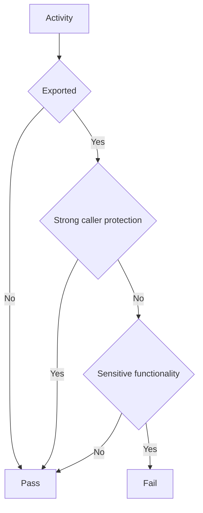

## Overview

If an exported activity does not define [`android:permission`](https://developer.android.com/guide/topics/manifest/activity-element#prmsn) with a proper protection level and performs or grants access to sensitive functionality, another third-party app outside the intended trust boundary can start it with an `Intent` and reach that functionality without going through the app's intended flow. See @MASTG-KNOW-0132 for details on activities, @MASTG-KNOW-0017 for permissions and protection levels, and @MASTG-KNOW-0020 for the IPC model of Android.

This test checks whether the app exposes sensitive functionality through exported and unprotected activities.

**Example Attack Scenario:**

Suppose a banking app protects its account screen behind a login activity but also declares an unprotected account-details activity that is exported, for example by setting `android:exported="true"` and without any limiting `android:permission`.

1. An attacker reverse engineers the app and finds the exported account-details activity (see @MASTG-TECH-0160).
2. The attacker writes a malicious app that calls `startActivity` with an explicit intent targeting that activity by its component name.
3. The account-details activity starts directly, without going through the login activity.
4. The account-details activity displays the victim's account data without requiring authentication.

## Steps

1. Use @MASTG-TECH-0013 to reverse engineer the app.
2. Use @MASTG-TECH-0117 to obtain the AndroidManifest.xml.
3. Use @MASTG-TECH-0160 to list the exported activities and their associated `android:permission`.
4. Use @MASTG-TECH-0014 to inspect the code of each exported activity.

## Observation

The output should contain all activities from the app. For each activity, record:

1. Activity name or class.
2. Accepted actions, categories, data schemes, hosts, paths, or intent filters.
3. Export state by recording `android:exported`.
4. Required caller permission, if any, by recording `android:permission` and its protection level.
5. Relevant entry points or flows reachable when the activity is started, for example `onCreate`, `onStart`, `onResume`, `onNewIntent`, or any flow reached from those methods.

## Evaluation

The test fails only if all of the following are true:

1. The activity is exported. For example, an activity with `android:exported="true"`.
2. The activity does not enforce strong caller protection.
3. The activity exposes or performs sensitive functionality.

**Further Validation Required:**

Use the following decision flow:

Strong caller protection means that the activity enforces a permission or equivalent access control appropriate for the intended caller set. A `signature` permission is usually appropriate when only apps signed by the same developer or organization should be able to start the activity.

The activity does not enforce strong caller protection when any of the following applies:

1. It has no required caller permission.
2. It uses a `normal` permission.
3. It uses a `dangerous` permission where trusted-app identity is required.
4. It uses a custom permission that is not declared with `<permission>` by the target app or another trusted package.
5. It uses a custom permission that is declared incorrectly, for example with the wrong name or the wrong protection level.

A `dangerous` permission may be acceptable only when the intended trust boundary is user-granted access rather than trusted-app identity. For example, this may be acceptable when the activity is intentionally available to any app that the user allowed to hold a specific runtime permission. It is not appropriate when the activity should only accept requests from a specific trusted app, vendor app, companion app, or same-signer app.

A custom permission is only strong protection if it resolves to a trusted `<permission>` declaration with an appropriate protection level, usually `signature`. The trusted declaration may be in the target app, a trusted companion app, a trusted SDK package, the platform, or an OEM package.

Inspect each exported activity using @MASTG-TECH-0023 to determine whether `onCreate`, `onStart`, `onResume`, `onNewIntent`, or any flow reached from those methods exposes or performs sensitive functionality.

!!! info
    `MainActivity` is a special case because it declares `MAIN` and `LAUNCHER`. Android expects launcher activities to be exported so the launcher can start the app, so `android:exported="true"` is not itself a vulnerability. However, the activity is still externally reachable and must be reviewed. If it displays sensitive data, performs sensitive actions, or processes attacker controlled intent data without enforcing authentication or authorization inside the activity, it can still be vulnerable. A custom signature permission is generally not appropriate for the real launcher activity because ordinary launcher apps are not signed with the app's certificate.