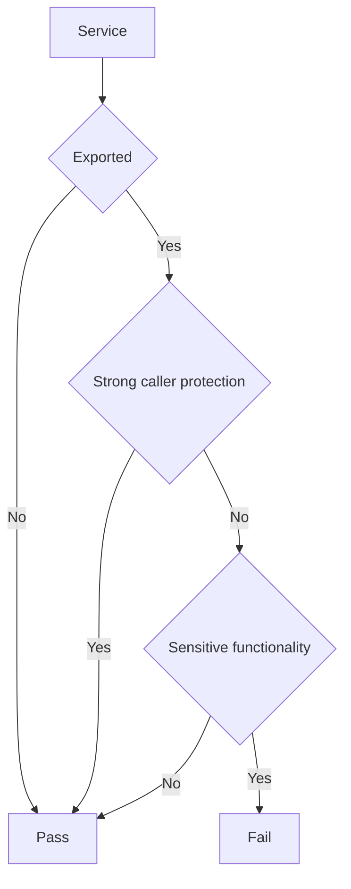

## Overview

If an exported service does not define [`android:permission`](https://developer.android.com/guide/topics/manifest/service-element#prmsn) with a proper protection level and performs or grants access to sensitive functionality, another third-party app outside the intended trust boundary can start or bind to it and invoke that functionality. See @MASTG-KNOW-0133 for details on services, @MASTG-KNOW-0017 for permissions and protection levels, and @MASTG-KNOW-0020 for the IPC model of Android.

This test checks whether the app exposes sensitive functionality through exported and unprotected services.

## Steps

1. Use @MASTG-TECH-0013 to reverse engineer the app.
2. Use @MASTG-TECH-0117 to obtain the AndroidManifest.xml.
3. Use @MASTG-TECH-0161 to list the exported services and their associated `android:permission`.
4. Use @MASTG-TECH-0014 to inspect the code of each exported service.

## Observation

The output should contain all services from the app. For each service, record:

1. Service name or class.
2. Whether it is started, bound, or both.
3. Accepted actions or intent filters.
4. Export state by recording `android:exported`.
5. Required caller permission, if any, by recording `android:permission` and its protection level.
6. Exposed bound-service interface, if any, for example Binder, Messenger, AIDL, or another bound-service API.
7. Relevant runtime caller checks, if any, for example `checkCallingPermission`, `enforceCallingPermission`, `checkCallingOrSelfPermission`, or `enforceCallingOrSelfPermission`.
8. Every entry point or flow reachable when the service is started or bound, for example `onStartCommand`, `onBind`, `onRebind`, `onHandleIntent`, or any exposed bound-service interface method.

## Evaluation

The test fails only if all of the following are true:

1. The service is exported. For example, a service with `android:exported="true"`.
2. The service does not enforce strong caller protection.
3. The service exposes or performs sensitive functionality.

**Further Validation Required:**

Use the following decision flow:

Strong caller protection means that the service enforces a permission or equivalent access control appropriate for the intended caller set. Use the same protection-level criteria described in @MASTG-TEST-0364.

Inspect each exported service using @MASTG-TECH-0023 to determine whether `onStartCommand`, `onBind`, `onRebind`, `onHandleIntent`, or any exposed bound-service interface reaches sensitive functionality.
