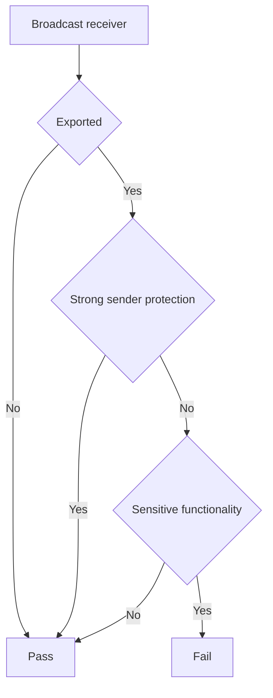

## Overview

If a broadcast receiver is exported, not protected against untrusted senders, and performs or grants access to sensitive functionality, another third-party app outside the intended trust boundary can send a broadcast to it and invoke that functionality from their `onReceive` method.

For manifest-declared receivers, relevant manifest attributes include [`android:exported`](https://developer.android.com/guide/topics/manifest/receiver-element#exported) and [`android:permission`](https://developer.android.com/guide/topics/manifest/receiver-element#prmsn). For context-registered receivers, relevant APIs and arguments include the `Context.registerReceiver()` and `ContextCompat.registerReceiver()` overloads that set `broadcastPermission` and `flags` (especially the `RECEIVER_EXPORTED` and `RECEIVER_NOT_EXPORTED` flags).

See @MASTG-KNOW-0x03 for the full list of relevant overloads and more general details on broadcast receivers.

This test checks whether the app exposes sensitive functionality through exported and unprotected broadcast receivers.

**Example Attack Scenario:**

Suppose a banking app declares a broadcast receiver that resets the user's password based on extras in the received intent, and the receiver is exported with no `android:permission`.

1. An attacker reverse engineers the app and finds the exported receiver, the action it listens for, and the extras it reads (see @MASTG-TECH-0162).
2. The attacker writes a malicious app that sends a broadcast targeting the receiver explicitly, with attacker-chosen extras.
3. The receiver acts on the unvalidated extras and resets the password (and may disclose the old one to the log).
4. The attacker takes over the account without any interaction from the victim.

## Steps

1. Use @MASTG-TECH-0013 to reverse engineer the app.
2. Use @MASTG-TECH-0117 to obtain the AndroidManifest.xml.
3. Use @MASTG-TECH-0x03 to list manifest-declared broadcast receivers, their export status, intent filters, and associated `android:permission`.
4. Use @MASTG-TECH-0014 to look for the relevant APIs.

## Observation

The output should contain all broadcast receivers from the app. For each receiver, record:

1. Receiver name or class.
2. Whether it is manifest-declared or context-registered.
3. Accepted actions or intent filters.
4. Export state:
    - For manifest-declared receivers, record `android:exported`.
    - For context-registered receivers, record `RECEIVER_EXPORTED`, `RECEIVER_NOT_EXPORTED`, or the absence of an explicit flag.
5. Required sender permission, if any:
    - For manifest-declared receivers, record `android:permission` and its protection level.
    - For context-registered receivers, record `broadcastPermission` and its protection level.
6. Its `onReceive` implementation.

## Evaluation

The test fails only if all of the following are true:

1. The receiver is exported. For example, a manifest-declared receiver with `android:exported="true"` or a context-registered receiver with `RECEIVER_EXPORTED`.
2. The receiver does not enforce strong sender protection.
3. The receiver exposes or performs sensitive functionality.

**Further Validation Required:**

Use the following decision flow:

Strong sender protection means that the receiver enforces a permission or equivalent access control appropriate for the intended sender set. Use the same protection-level criteria described in @MASTG-TEST-0364.

Inspect each exported broadcast receiver using @MASTG-TECH-0023 to determine whether `onReceive` or any code reached from it exposes or performs sensitive functionality.
